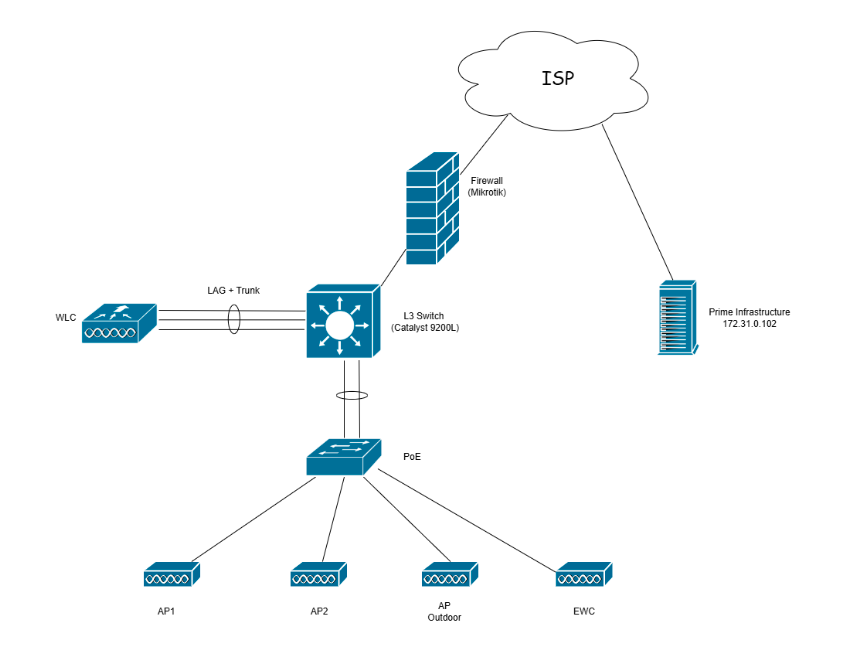
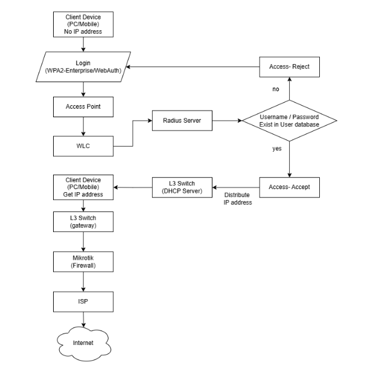

# Centralized Enterprise Network Infrastructure

This project focuses on designing and implementing a centralized enterprise network infrastructure for wireless management, authentication, monitoring, and network security.

The project was completed as a team-based university project during Computer Engineering studies.

## Authentication Workflow

## Features

- VLAN Segmentation
- Centralized Wireless Management
- Inter-VLAN Routing
- WPA2-Enterprise / Web Authentication
- RADIUS Authentication
- ACL Security Policies
- DHCP Services
- Network Monitoring
- Firewall Protection

## Technologies Used

### Networking Devices
- Cisco Catalyst 9200L
- Cisco Catalyst 2960
- Cisco WLC 2504
- Cisco Access Points

### Network Services
- FreeRADIUS
- DHCP
- WPA2-Enterprise
- ACL

### Monitoring & Management
- Cisco Prime Infrastructure
- Embedded Wireless Controller (EWC)

### Supporting Systems
- MikroTik RouterOS
- Raspberry Pi 4

## Project Report

- [Full Project Report](https://link.psu.th/826Xcy)

